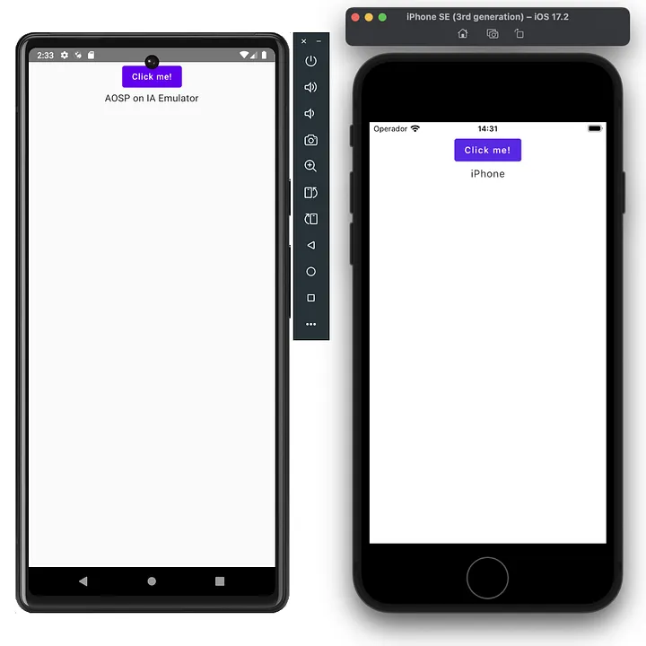

# Calling Native Swift code from Kotlin Multiplatform 

This guide outlines the technique for accessing platform-specific native Swift code (including non-Objective-C exposed third-party libraries) from your shared Kotlin Multiplatform code using the Dependency Inversion Principle (DIP).

### Core Principle: Dependency Inversion

Instead of the shared KMP code attempting to call native code directly, we use an abstraction (a Kotlin interface) defined in commonMain. Each native platform (Android/iOS) provides its **own concrete implementation** of this interface and injects it into the shared business logic.
#### Implementation Steps
1. Define the Interface in commonMainCreate a shared interface that defines the native functionality you need.

**File**: `commonMain/kotlin/InteropExample.kt`
```kotlin
Kotlininterface InteropExample {
    fun doSomethingNative(): String // Define the contract
}
```
2. Implement the Interface for iOS (Swift)
Create the implementation class in your iosApp Xcode project using Swift. This is where you call your native Swift code or third-party Swift libraries.

**File**: `iosApp/InteropExampleImpl.swift`
```swift
import ComposeApp // IMPORTANT: Import your KMP module

class InteropExampleImpl : InteropExample {
    func doSomethingNative() -> String {
        // Call the desired native Swift code here
        return UIDevice.current.model 
    }
}
```
**Tip**: If Xcode cannot find the InteropExample interface, _run a successful build (Command + B) first_.

3. Implement the Interface for AndroidProvide the Android-specific implementation in your Android module.

**File**: `androidMain/kotlin/InteropExampleImpl.kt`

```kotlin
import android.os.Build
class InteropExampleImpl : InteropExample {
    override fun doSomethingNative(): String {
        // Example of calling Android native code
        return Build.MODEL
    }
}
```

4. Update the Shared iOS Entry PointThe MainViewController function in your iosMain module must be updated to accept the interface implementation as a parameter.

**File**: `iosMain/kotlin/MainViewController.kt`
```kotlin
import androidx.compose.ui.window.ComposeUIViewController

// Modify the function to accept the dependency
fun MainViewController(interopExample: InteropExample) = ComposeUIViewController { 
    App(interopExample) // Pass it to the shared Composable
}
```

5. Inject the Dependency at the Platform Entry Points

Instantiate the platform-specific implementation:

Android
**File**: `MainActivity.kt`
```kotlin
// this file is inside androidMain
class MainActivity : ComponentActivity() {
    override fun onCreate(savedInstanceState: Bundle?) {
        super.onCreate(savedInstanceState)

        // Dependency inversion: study this ASAP if required
        val interopExample: InteropExample = InteropExampleImpl()
        setContent {
            App(interopExample)
        }
    }
}
```

iOS
**File**: `ContentView.swift`
```swift
// this file is inside iosApp, not to be confused with iosMain
import ComposeApp
struct ComposeView: UIViewControllerRepresentable {
    func makeUIViewController(context: Context) -> UIViewController {
        // Now DIP has been demostrated, we pass an implementation directly
        MainViewControllerKt.MainViewController(interopExample: InteropExampleImpl())
    }

    func updateUIViewController(_ uiViewController: UIViewController, context: Context) {}
}

struct ContentView: View {
    ...
}
```

Now you can preprare the main view to receive the parameter:
```kotlin
// this file is inside 
@Composable
@Preview
// here our interface will be expected
fun App(interopExample: InteropExample) {
    MaterialTheme {
        var content by remember { mutableStateOf("Your text will be replaced depending on platform") }

        Column(Modifier.fillMaxWidth(), horizontalAlignment = Alignment.CenterHorizontally) {
            Button(onClick = {
                content = interopExample.doSomethingNative()
            }) {
                Text("Click me!")
            }
            Column(Modifier.fillMaxWidth(), horizontalAlignment = Alignment.CenterHorizontally) {
                Text(content)
            }
        }
    }
}
```

And **Voilà**, our native code is working for both platforms.


#### Questions
* __Can I call thirt-party dependencies by doing this?__ Yes, as long as you make your own implementations on each platform. You cannot call the dependency itself from your Kotlin code.
* __Can I use suspend functions?__ Short answer: Yes!. Long answer: Yeeeeeeeeeeeeees.
* __Can I return my own data classes instead of primitive types?__ Yes, Kotlin will compile an Objective-c class to be returned.


#### Recommendations
* Keep it simple: If your function returns a really complex object you may have some problems to use it. Make your data classes/objects to use attributes as primitive as you can to make it easy to use on each platform implementation while returning values.
* If you have to treat some values (like bytes) in Swift, make it on the iosMain side: Kotlin developers have been working hard so you can use classes like NSData, NSObject and so on to make our life easier.

#### Next steps
Combine this artifice with Dependency injection to handle instances more efficiently.

#### Conclusion
You can effectively use Dependency inversion to handle native implementations for Android and iOS.